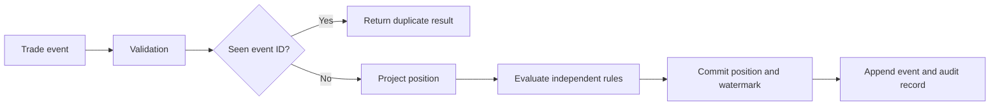

# Sentinel

Sentinel is a small C++20 trade-surveillance engine that maintains account
positions and evaluates every trade against compliance rules. The first version
focuses on the failure modes that make event processing difficult: duplicate
delivery, out-of-order events, deterministic replay, and auditable decisions.

## What it demonstrates

- Idempotent processing keyed by event ID
- Per-account, per-symbol position state
- Position-limit, restricted-symbol, and large-notional rules
- Out-of-order event detection with account watermarks
- Immutable processing audit records
- Deterministic state reconstruction from retained events
- A measured benchmark path instead of unverified performance claims

## Design



The core deliberately has no framework or database dependency. `Rule` is the
extension point for new surveillance checks. Persistence and transport adapters
will sit outside the engine so a PostgreSQL repository, message broker, CLI, or
WebAssembly interface can be added without changing compliance logic.

## Build and run

The repository includes CMake for portable builds and a Makefile for a zero-setup
local build with Clang or GCC.

```bash
make
./build/sentinel_demo
make test
make benchmark
```

Pass an event count directly to the benchmark when needed:

```bash
./build/sentinel_benchmark 500000
```

## Project layout

```text
include/sentinel/  Public domain types, rules, and engine API
src/               Engine implementation
apps/              Executable demos and future adapters
tests/             Deterministic behavioral tests
bench/             Throughput and latency benchmark
```

## Next increments

1. Add a PostgreSQL event and audit repository behind a storage interface.
2. Add trade-cancel and amend events with sequence validation.
3. Expose a narrow JSON API for ingestion and state inspection.
4. Compile the dependency-free core to WebAssembly for the Vercel demo.
5. Add property-based event-sequence tests and concurrent ingestion benchmarks.

