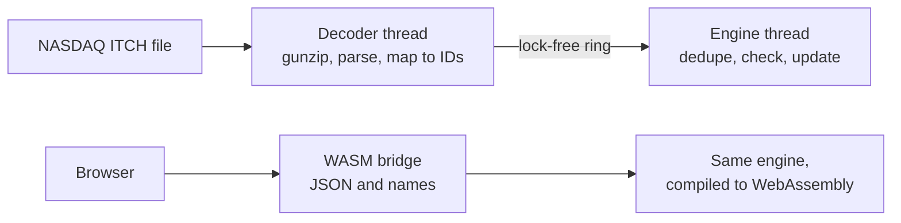

# Sentinel

A C++20 trade-surveillance engine. It tracks every account's position in every
symbol and checks each trade against compliance limits in about **20 ns**. It
decodes NASDAQ's ITCH 5.0 market-data feed, and the same engine runs in the
browser through WebAssembly.

**Live demo:** [sentinel-demo-peach.vercel.app](https://sentinel-demo-peach.vercel.app)

Released under the [MIT License](LICENSE).

See [Architecture](docs/architecture.md) for the event path, state model,
replay contract, and WebAssembly boundary.

## Results

Same machine (Apple M4, clang 21, `-O3`), same workload of 5 million trades
across 256 accounts × 1,024 symbols with ~1% duplicate deliveries and ~1% late
timestamps; about a quarter of trades raise an alert.

|                    | v1 (strings, maps, mutex) | v2 (this design) |
| ------------------ | ------------------------- | ---------------- |
| Time per trade     | 635 ns                    | **19.0 ns**      |
| Throughput         | 1.6 M trades/s            | **53 M trades/s** |
| p99 / p99.9        | —                         | 125 / 167 ns     |

v1 is commit `0fc5225`, run on the identical pre-generated trades. Per-call
latency includes the clock's 42 ns resolution on macOS, so the median reads as
one tick; throughput is the precise number. Reproduce with `make benchmark`.

### Where the time goes

The benchmark also runs smaller streams. The checks themselves take about 4 ns;
the rest is waiting on memory, because the set of seen event IDs grows with the
stream and each lookup lands on a random slot:

| Trades    | Duplicate-ID set | Time per trade |
| --------- | ---------------- | -------------- |
| 10,000    | 0.3 MB (in L2)   | 3.8 ns         |
| 100,000   | 2.1 MB (in L2)   | 4.2 ns         |
| 1,000,000 | 17 MB (past L2)  | 8.4 ns         |
| 5,000,000 | 134 MB (DRAM)    | 19.0 ns        |

So the next speed-up is not fewer instructions but less memory. For example,
if event IDs are increasing per source, a small sliding window replaces the
ever-growing set.

### ITCH decoding

Tracking the order book dominates ITCH processing: every add, cancel, replace
and delete updates a table of live orders. Replacing `std::unordered_map` (a
heap node per order) with a flat open-addressing table
([`order_table.hpp`](include/sentinel/order_table.hpp)) made the decoder
**4.2× faster: 6.2 M → 26 M messages/s**, with identical output. That was
measured on a 20-million-message file with about a million live orders,
generated by [`make_itch.py`](bench/make_itch.py).

## How it works

The whole design follows from one rule: **do the expensive work once, at the
edge, so the hot path is a few array reads and compares.**

1. **Names become integers at the edge.** `"ALPHA-7"` and `"AAPL"` are mapped to
   small IDs once ([`names.hpp`](include/sentinel/names.hpp)). The engine never
   hashes or compares a string. NASDAQ already sends symbols as integer "locate"
   codes.
2. **State is flat arrays.** A position is `positions[account * symbols + symbol]`;
   limits and restricted flags are per-symbol arrays. Everything is preallocated,
   so processing a trade never allocates.
3. **Duplicates are caught with an open-addressing hash set**
   ([`id_set.hpp`](include/sentinel/id_set.hpp)): one flat array, linear probing,
   so a lookup usually touches one cache line.
4. **Money is an integer.** Prices are in 1/10,000 of a dollar (ITCH's own
   scale). Input bounds guarantee `quantity × price` and every position fit in
   64 bits, so there is no floating-point drift and no overflow.
5. **A decision is one byte of flags.** Each check sets a bit. Human-readable
   explanations are built only when something displays them.
6. **One thread owns the state, so there are no locks.** Other threads hand it
   trades through a lock-free single-producer/single-consumer ring
   ([`spsc_ring.hpp`](include/sentinel/spsc_ring.hpp)).
7. **It is deterministic.** The same trades in the same order always produce
   the same decisions, so the engine can rebuild its state by replaying its log.



### The checks

| Alert                   | Fires when                                          | Severity |
| ----------------------- | --------------------------------------------------- | -------- |
| `POSITION_LIMIT_BREACH` | \|position after the trade\| is above the symbol's limit | Critical |
| `RESTRICTED_SYMBOL`     | the symbol is on the restricted list                | Critical |
| `LARGE_NOTIONAL`        | quantity × price is above the threshold             | Warning  |
| `OUT_OF_ORDER_EVENT`    | the timestamp is older than the account's latest    | Warning  |

Alerts flag a trade for review; they don't block it. A repeated event ID is
reported as `DUPLICATE` and changes nothing. Malformed input (zero ID, unknown
account, non-positive quantity, out-of-range price) is rejected with a specific
status and also changes nothing.

## How it's tested

- **Differential testing.** [`model_tests.cpp`](tests/model_tests.cpp) runs
  1,000,000 random trades, including duplicates, late timestamps and invalid
  input, through both the engine and a deliberately naive model built on
  `std::map` and `std::set`. Every single decision must match. Changing one `<`
  to `<=` in the engine makes this test fail.
- **The order table gets the same treatment**: a million random inserts,
  updates and erases must match `std::unordered_map` exactly.
- **Unit tests** for each rule, boundary values, rejection without side
  effects, overflow bounds, replay, and the ITCH decoder, message by message.
- **Sanitizers.** The full suite runs under AddressSanitizer,
  UndefinedBehaviorSanitizer, and ThreadSanitizer (which checks the lock-free ring).
- **Fuzzing.** Random bytes go through the ITCH framing, the decoder and the
  engine under libFuzzer ([`itch_fuzz.cpp`](fuzz/itch_fuzz.cpp)).
- **CI** runs all of the above on GCC and Clang, plus the CMake build, the
  WebAssembly build and the dashboard build ([`ci.yml`](.github/workflows/ci.yml)).

## Market data: NASDAQ ITCH 5.0

[`itch.hpp`](include/sentinel/itch.hpp) decodes NASDAQ's TotalView-ITCH feed.
It keeps the book of live orders so that each execution can be attributed to
the resting order's symbol, side, price and participant, then feeds it to the
engine as a trade. The decoder is checked against the specification message by
message and fuzzed.

**Real data:** the first 215 million messages (about half the session) of
NASDAQ's 30 January 2019 feed, streamed straight from NASDAQ into the replay
tool:

| Messages   | Executions checked | Participants | Rejected as malformed |
| ---------- | ------------------ | ------------ | --------------------- |
| 214,948,560 | 4,973,362         | 108          | 0                     |

2,941 executions (0.06%) reused a match number already seen and were reported
as duplicates; why ITCH repeats them is not yet investigated. Throughput in
that run was limited by the download, so decoder speed comes from the
synthetic benchmark above.

```bash
make build/itch_replay
python3 bench/make_itch.py build/synthetic.itch 20000000   # spec-valid synthetic day
./build/itch_replay build/synthetic.itch

# Real days (several GB each) can be streamed without saving them:
curl -s "https://emi.nasdaq.com/ITCH/Nasdaq%20ITCH/01302019.NASDAQ_ITCH50.gz" | ./build/itch_replay -
```

## Build and run

Needs a C++20 compiler (Clang or GCC) and zlib.

```bash
make            # demo, tests, benchmark, itch_replay
make test       # 25 tests
make sanitize   # AddressSanitizer + UndefinedBehaviorSanitizer
make tsan       # ThreadSanitizer
make benchmark
./build/demo    # walks through every behaviour in six trades
```

CMake works too: `cmake -S . -B out && cmake --build out && ctest --test-dir out`.

### Web dashboard

```bash
source /path/to/emsdk/emsdk_env.sh
make wasm                        # compiles the engine to web/public/wasm
cd web && npm install && npm run dev
```

The dashboard streams simulated order flow through the WebAssembly engine and
charts it live. You can inject trades, change limits and re-evaluate history
under the new limits, open any decision to see the rule inputs, and run the
benchmark workload in the browser.

## Layout

```text
include/sentinel/   types, engine, id_set, names, spsc_ring, itch, order_table
src/                engine.cpp, itch.cpp
apps/               demo, itch_replay, wasm_bridge (browser API)
bench/              benchmark, its shared workload, ITCH file generator
tests/              unit, differential, ITCH, and ring tests
fuzz/               libFuzzer target for the ITCH decoder
web/                React dashboard
```

## Trade-offs and next steps

- **Memory for speed.** Positions take `accounts × symbols × 8` bytes: 2 MB for
  the benchmark, 64 MB for a full ITCH day. Much larger universes would need a
  sparse layout.
- **The duplicate set grows for the whole session**, and it is the main cost at
  scale (see above). A production system would reset it each session and, where
  IDs are ordered, use a bounded window instead.
- **Only half a real trading day so far**, and decoder speed on real data is
  unmeasured (that run was download-bound). The repeated match numbers above
  are the first thing to investigate.
- **Latency on macOS is limited by a 42 ns clock.** On x86 Linux, timing with
  the CPU cycle counter (`rdtsc`) would resolve the median.
- **State lives in memory.** The replay log (or the ITCH file itself) is the
  source of truth; snapshots and persistence would sit outside the engine.
