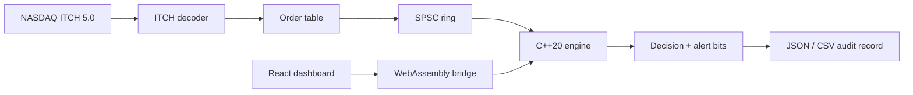

# Architecture

Sentinel separates market-data decoding, deterministic policy evaluation, and
presentation. The boundary is intentional: the engine accepts compact numeric
events and does not know about JSON, browser state, files, or exchange symbols.

## Event path

1. An adapter converts a source event into `Trade`. Names are interned into
   integer account and symbol IDs before the event reaches the engine.
2. `Engine::process` validates bounded input fields before reading state.
3. The event-ID set handles at-least-once delivery. A duplicate returns the
   current position without applying the event again.
4. The engine calculates the prospective position and checks it for overflow.
5. Independent checks set bits for position, restriction, notional, and event
   ordering signals.
6. The position, account watermark, and event ID are committed together.
7. Adapters can turn the decision into a stable JSON or CSV audit record.

## State ownership

`Engine` is deliberately single-writer. It contains no locks, and callers that
receive events on another thread pass them through `SpscRing`. This keeps the
hot path deterministic and makes race ownership visible at the adapter layer.

The state tables are allocated from configured account and symbol capacities:

- Positions use a flat `[account × symbol]` array.
- Event watermarks use one integer per account.
- Position limits and restriction flags use one entry per symbol.
- Event IDs use an open-addressing set sized for the expected session.

## Replay contract

When logging is enabled, the engine retains every valid arrival, including
duplicates. `replay()` clears derived state and processes those arrivals again
in their original order. Policies remain configured, so replay answers the
question: “What decisions does this event sequence produce under the current
policy?”

Long-running ITCH replay disables the in-memory log because the feed file is
already the authoritative replay source.

## Numeric model

Prices are signed 64-bit integers in units of 1/10,000 dollar, matching NASDAQ
ITCH. Quantities, prices, and positions have explicit upper bounds. Their
products remain inside signed 64-bit range, avoiding floating-point drift and
undefined integer overflow in the hot path.

## Browser runtime

Emscripten compiles the same engine source into WebAssembly. The bridge owns
string interning and JSON serialization. The React application only controls
the simulation and visual state; all trade decisions come from C++.

## Extension points

- Add a feed adapter without changing `Engine`.
- Persist `AuditRecord` output in a database or object store.
- Add policy setters alongside the existing limit and restriction controls.
- Partition accounts across independent engine instances for parallelism.
- Replace the SPSC ingress with a broker consumer at the process boundary.
